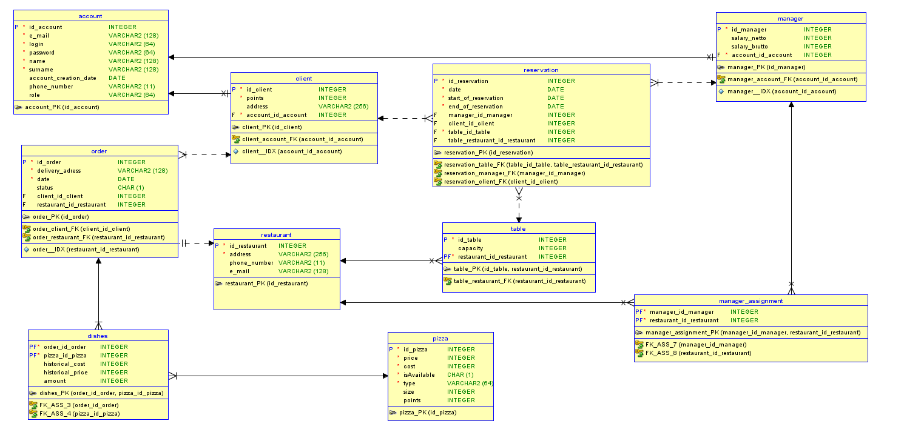

# **Opis projektu**

Aplikacja internetowa umożliwiająca zarządzanie siecią pizzeri. W zależności od roli w systemie interfejs oraz funkcjonalność aplikacji będzie się zmieniała. Baza danych będzie przechowywała informacje o użytkonikach systemu oraz dane o potrawach.

W aktualnej wersji w celu połączenia z bazą danych należy utworzyć nową bazę w środowuisku **Microsoft SQL Server Managment Studio**. Następnie utworzyć w niej Query wykorzustując skrypt zamieszczony w repozytorium: **pizza_restaurant_ver_5_DDL.sql** (mieści się on w folderze resources).

---

## **Role w systemie:**
1. Menedżer/Właściciel posiada: 
   - [ ] możliwość przyjmowania zamówień telefonicznych, w postaci wypełniania formularza, w podobny sposób jaki robi to zalogowany użytkownik,
   - [ ] możliwość rezerwacji stolików (dodawaniem, edycja i podgląd rezerwacji),
   - [X] możliwość przypisywania punktów lojalnościowych, 
   - [X] możliwość modyfikowania cen pizzy,
   - [ ] możliwość wygenerowania raportu pokazującego dochody w danym przediale czasowym (dochód to różnica ceny bazowej, która ustawiana jest odgórnie w programie a ceny ustalonej przez menedżera).
2. Klient niezalogowany posiada:
   - [X] możliwość zarejestrowania w systemie,
   - [X] możliwość zalogowania się w systemie,
   - [X] dostęp do menu,
   - [X] dostęp do informacji o lokalach(adres/kontakt),
   - [X] możliwość złożenia zamówienia pod podanym numerem telefonu.
3. Klient zalogowany posiada:
   - [ ] możliwość zmiany hasła,
   - [X] opcję wylogowania,
   - [ ] dostęp do menu oraz możliwość złożenia zamówienia przez stonę z wyborem adresu dostawy,
   - [ ] dostęp do informacji związanych ze swoim profilem,
   - [ ] możliwość wyświetlenia raportu, w którym są zestawione rodzaje pizz (posortowane rosnąco/malejąco) według wydanej przez Klienta kwoty w danym okresie czasu oraz łączna kwota zamówień (jako podsumowanie).

---

## **Schemat bazy danych**

---

## **Autorzy**
| Imię | Nazwisko|github|
|------|---------|----|
|Michał|Jackowski|[jacek13](https://github.com/jacek13)|
|Mikołaj|Smoła|[djnick](https://github.com/djnick)|
|Mateusz|Dąbrowski|[Guardianek34](https://github.com/Guardianek34)|
|Jakub|Domerecki|[Dom3r](https://github.com/Dom3r)|
|Tomasz|Długosz|[tmdlu](https://github.com/tmdlu)|
